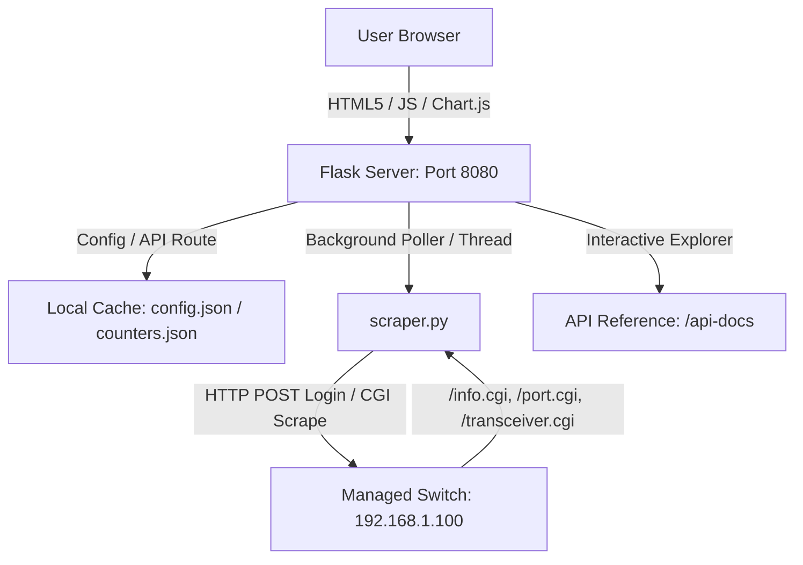

# 🌐 Switch Dashboard (HORACO & OEM Managed Switches)

A premium, high-performance, **real-time monitoring dashboard** designed for Managed Chiese Switches similar to HORACO HC-SWTGW218AS 8-Port + 2-Port SFP+ (10G) managed switches. The dashboard queries the switch’s native HTTP CGI interface, meaning **no SNMP setup or configuration is required**. 

Built with a gorgeous, high-tech glassmorphic dark-mode interface, it features automatic rolling bandwidth history, persistent byte-delta tracking, MAC address table searches, on-demand optical transceiver telemetry (DDMI), and a built-in interactive API explorer.


This dashboarb support these device:
 - [HORACO HC-SWTGW218AS](https://s.click.aliexpress.com/e/_c31NG1u1)
 - [HORACO HC-SWTGW215AS](https://s.click.aliexpress.com/e/_c3hKfeLJ)
 - [keepLink KP9000-9XH-X](https://s.click.aliexpress.com/e/_c4UKLfOv)

---

## 🌟 Premium Features

### 1. High-Tech Glassmorphic Interface
* **Stunning Dark Mode**: Custom typography (Outfit/Inter/JetBrains Mono), harmonized color palettes, and frosted-glass components (`backdrop-filter: blur(12px)`) that look amazing on operations consoles.
* **Micro-Animations**: Dynamic state transitions, pulse loading indicators, and rotating refresh controls.
* **Adaptive Grid Layout**: Tailored viewports supporting smooth font scaling (S / M / L / XL) persisted directly to server settings.

### 2. SFP+ Transceiver Diagnostics & Telemetry (DDMI)
* **Real-time Optical Sensors**: Click the speed label of an SFP+ port (e.g. Port 9) to display physical module metadata (Vendor, Model, Serial, Compliances, Wavelength) and real-time DDMI diagnostics.
* **Visual Telemetry Bars**: Progress bars dynamically colored based on safe thresholds for:
  * **Temperature** (°C)
  * **Supply Voltage** (V)
  * **Bias Current** (mA)
  * **TX/RX Optical Power** (dBm)
* **Dynamic Refresh Loop**: Dedicated refresh button inside the modal to re-scrape physical hardware registers on-demand.
* **Bs4 Malformed Parsing Fix**: Custom pre-parsing sanitization engine handles malformed switch micro-controller HTML tables (like unclosed `<th>` tags closed by `</td>`), ensuring perfect parsing.


### 3. Interactive Bandwidth History Charts
* **Multi-Scale Sparklines**: Click any standard port speed to launch real-time bandwidth charts powered by **Chart.js**.
* **Three-Tier Historical Ranges**:
  * `Live` (High-resolution, real-time delta speed in bits per second)
  * `1-Hour` (Rolling 1-hour average in Bytes per second)
  * `24-Hour` (Rolling 24-hour average in 15-minute windows)

### 4. Advanced MAC Forwarding Table
* **Flexible Search & Filtering**: Multi-column text filtering makes searching by VLAN, Port, MAC, or status trivial.
* **Interactive Height Controls**: Dynamically drag to resize table heights (saves user preference to `settings.json` on disk).
* **Manual Re-indexing**: On-demand POST request scraper forces active switches to dump fresh bridge routing entries.


### 5. Configurator & Persistent Store
* **Multi-Switch Panel**: Dynamically add, modify, or delete switches through a beautifully organized `/config` route.
* **Persistent Accumulation**: Standard bytes counters are persistent across server reboots, complete with a delta tracking script to auto-detect and compensate for switch physical reboots without corrupting traffic metrics.
* **Annotation Layer**: Add custom, persistent labels/notes (e.g., "Uplink to NAS", "SmartTV") to any port.

### 6. Interactive Developer API Reference
* **Built-in Docs**: Hosted locally at `/api-docs` with a beautiful, fast sidebar navigation.
* **Developer Resources**: Contains interactive code cards, response payload previews, parameter grids, and copy-to-clipboard buttons for instant cURL examples.

### 7. DHCP Snooping & IGMP Snooping Telemetry
* **Global Configuration Tracking**: Scrapes global enable state for DHCP Snooping and IGMP Snooping, rendering status badges directly on the dashboard.
* **Port-Level Trust Badges**: Real-time port trust classifications are fetched from `/port.cgi` to show customized untrusted and trusted labels.
* **IGMP Multicast Tables**: Fully parsed multicast group database extracted from `/igmp.cgi?page=dump` displayed in an expandable glassmorphic table.

### 8. Jumbo Frame Configuration Status & Size
* **Frame Size Scraper**: Inspects `/fwd.cgi?page=jumboframe` to retrieve Jumbo Frame configuration status and parse the exact selected frame size (e.g. `9216Bytes`).

### 9. Server-Side Configuration Backups Manager
* **Config Backups**: Safely triggers configuration archive downloads via `/config_back.cgi?cmd=conf_backup`, storing them directly on the server's disk space.
* **Interactive Manager**: Beautiful `/backups` interface listing saved configs with quick downloads and single-click deletions protected by glassmorphic modal dialogues.

### 10. Secure Device Reboot Modal
* **Remote Power Cycle**: Triggers a remote switch reboot via `/reboot.cgi` securely.
* **Safety Confirmation**: Uses an immersive custom warning card modal using frosted glass backdrop effects, with real-time feedback loops during reboot execution.

---

## 🛠️ System Architecture



* **Backend**: Flask (Python 3.9+), single-worker polling thread to prevent session thrashing.
* **Frontend**: Vanilla ES6 JS, Custom CSS (Aesthetic glassmorphism), Chart.js (multi-tier canvas).
* **Scraper**: Custom HTTP CookieJar scraper communicating with switch `/login.cgi`, `/info.cgi`, `/port.cgi?page=stats`, and `/transceiver.cgi`.

---

## 📦 Requirements

* **Python 3.9+**
* **Operating System**: Linux with `systemd` (Debian, Ubuntu, CentOS, Arch) or standalone Windows/macOS.
* **Network Access**: Port 80 access to target managed switches (e.g. HORACO `HC-SWTGW218AS` or OEM equivalents).

---

## 🚀 Installation & Deployment (Linux)

Our automated script handles the entire installation seamlessly, creating a dedicated Python virtual environment to avoid interfering with system packages.

### Automated Install

```bash
# Clone the repository
git clone https://github.com/yourusername/switch-dashboard.git
cd switch-dashboard

# Run the installer as root
sudo bash install.sh
```

The script will:
1. Copy all project files to `/opt/switch-dashboard/`.
2. Check for system-level dependencies (`python3-pip`, `python3-venv`).
3. Set up a secure virtual environment inside `/opt/switch-dashboard/venv`.
4. Install all requirements (`Flask`, `BeautifulSoup4`).
5. Generate and register a `switch-dashboard.service` with `systemd`.
6. Start and enable the service on boot.

Once completed, the dashboard is live at:
* **Dashboard**: `http://<your-ip>:8080`
* **API Documentation**: `http://<your-ip>:8080/api-docs`
---

## 🐳 Docker Deployment

You can deploy the Switch Dashboard as a lightweight Docker container. All persistent configurations, history files, and switch backups are managed inside a single volume or host directory mapping.

### 💾 Persistent Data Mapping
The dashboard keeps its state in several files and a backup folder:
* **Configurations & Settings**: `config.json`, `settings.json`, `notes.json`
* **Bandwidth & Counters**: `counters.json`, `history_hourly.json`, `history_daily.json`
* **Switch Backups**: `/backup/` subdirectory

All of the above items are unified under the path specified by the `DASHBOARD_DATA_DIR` environment variable (defaults to `/data` in the container). You only need to mount/persist this single folder!

### Option A: Using Docker Compose (Recommended)

A pre-configured `docker-compose.yml` is provided in the repository.

1. **Clone the repository**:
   ```bash
   git clone https://github.com/yourusername/switch-dashboard.git
   cd switch-dashboard
   ```

2. **Configure your switches**:
   You can either edit `config.json` before running the container, or simply let the container initialize the default `config.json` inside the mounted volume directory (`./data`), and then edit it there or via the dashboard's `/config` page.

3. **Start the container**:
   ```bash
   docker compose up -d
   ```

4. **Access the dashboard**:
   Go to `http://<your-ip>:8080` in your web browser. All your configs, notes, backups, and charts history will be persisted in the local `./data` folder on the host.

### Option B: Using Docker CLI

To run the container manually with the Docker CLI:

1. **Build the image**:
   ```bash
   docker build -t switch-dashboard .
   ```

2. **Run the container with a volume**:
   ```bash
   docker run -d \
     --name switch-dashboard \
     --restart unless-stopped \
     -p 8080:8080 \
     -v /absolute/path/to/your/data:/data \
     -e DASHBOARD_DATA_DIR=/data \
     switch-dashboard
   ```
   *Replace `/absolute/path/to/your/data` with the actual directory path on your host where you want to store your persistent data.*

---

## 🔌 Customizing with YAML Device Templates

The dashboard supports template-driven scraping. This enables users to add support for any managed switch model simply by writing a declarative YAML blueprint and placing it in the `./device-templates/` directory.

### How to Create a Template
A switch template is named `<model_name>.yaml` (where `<model_name>` matches the **model** field configured for the switch in `/config` or `config.json`).

Here is a complete reference of the YAML blueprint schema:

```yaml
model: "HC-SWTGW218AS"          # The exact switch model name
manufacturer: "Horaco"           # Brand/Manufacturer name

# 1. Device Global Information (from /info.cgi key-value tables)
device_info:
  url: "/info.cgi"
  method: "key_value_grid"
  mappings:
    uptime: "Sys Uptime"
    mac: "MAC Address"
    ip: "IP Address"
    firmware: "Firmware Version"
    model: "Device Model"

# 2. Port Link Settings & Statuses
ports:
  url: "/info.cgi"
  source: "info_table"           # "info_table" (Horaco style) or "port_table" (KeepLink style)
  columns:
    port: 0
    link: 1
    duplex: 2
    speed: 3
    flow_control: 4

# 3. Port Transmission/Reception counters
statistics:
  url: "/port.cgi?page=stats"
  method: "header_aware"
  terms:
    tx_packets: ["txgoodpkt", "txpackets", "tx packet", "txok"]
    rx_packets: ["rxgoodpkt", "rxpackets", "rx packet", "rxok"]
    tx_bytes: ["txbytes", "tx_bytes", "txgoodbytes"]
    rx_bytes: ["rxbytes", "rx_bytes", "rxgoodbytes"]

# 4. DHCP Snooping Status & Trusted Ports
dhcp_snooping:
  url: "/dhcp_snooping.cgi?page=dump"
  enable_input_name: "enable_dhcpsnp"
  ports_form_action: "page=static"
  trust_checkbox_class: "chkp"

# 5. IGMP Snooping Multicast Groups Table
igmp:
  url: "/igmp.cgi?page=dump"
  enable_input_name: "enable_igmp"
  table_header_keywords: ["IP Address", "Port", "VLAN ID"]

# 6. Jumbo Frame Parameter
jumbo_frame:
  url: "/fwd.cgi?page=jumboframe"
  enable_input_name: "enable_jumbo"
  select_name: "jumboframe"

# 7. MAC Address Forwarding Table (with paging)
mac_table:
  url: "/mac.cgi?page=fwd_tbl"
  page_parameter: "pageidx"
  perpage_parameter: "perpage"
  perpage_value: "3"
  cmd_parameter: "cmd"
  cmd_value: "goto"

# 8. CGI Configuration Backup download
backup:
  url: "/config_back.cgi?cmd=conf_backup"
  referer_path: "/config_back.cgi"
  method: "GET"

# 9. Switch Remote Reboot action
reboot:
  url: "/reboot.cgi"
  referer_path: "/reboot.cgi"
  method: "POST"
  post_data:
    cmd: "reboot"
```

### Adding Model Custom Graphics
To add a dedicated device photo or graphic to the switch card:
1. Place a `.png`, `.jpg`, or `.jpeg` file in the `./device-templates/` directory.
2. Name the file exactly after the switch model (e.g. `HC-SWTGW218AS.png`).
3. If no custom image is found, the system will seamlessly fall back to a beautifully stylized 8-port switch icon located at `/static/switch_icon.png`.

---

## 🔧 Manual Setup & Debugging

If you prefer to configure the dashboard manually or want to run it on non-systemd machines (Windows / macOS):

### 1. Install Dependencies
```bash
python3 -m venv venv
source venv/bin/activate
pip install -r requirements.txt
```

### 2. Configure Monitored Switches
Create or edit `/opt/switch-dashboard/config.json`:
```json
{
  "title": "Network Command Center",
  "refresh_interval": 10,
  "mac_refresh_multiplier": 5,
  "switches": [
    {
      "name": "HORACO Core",
      "ip": "192.168.1.100",
      "username": "admin",
      "password": "admin",
      "model": "HC-SWTGW218AS",
      "port_count": 9
    }
  ]
}
```

### 3. Run Standalone
```bash
python3 app.py
```

---

## 📋 REST API Reference

The dashboard includes a set of REST endpoints. For complete details, response payloads, and copyable cURL examples, navigate to the `/api-docs` route.

| Method | Endpoint | Description |
| :--- | :--- | :--- |
| `GET` | `/api/switches` | Returns live status of all switches and ports, including custom notes. |
| `GET` | `/api/switches/<ip>/transceiver` | Returns parsed SFP module diagnostics and DDMI telemetry. |
| `POST`| `/api/switches/<ip>/refresh_mac` | Forces an immediate scrape and returns the active MAC forwarding table. |
| `GET` | `/api/speeds` | Returns real-time delta speed states (Bytes/s, bps) for active interfaces. |
| `GET` | `/api/history` | Returns high-res historical statistics for Chart.js (`live`, `1h`, `24h`). |
| `POST`| `/api/notes` | Attaches a persistent label/description to a port (saves to `notes.json`). |
| `GET` | `/api/settings` | Retrieves global UI preferences (e.g., base font scale). |
| `POST`| `/api/settings` | Updates global UI settings on the disk. |
| `POST`| `/api/reset` | Purges cumulative logs and bandwidth cache, resetting delta Baselines. |
| `POST`| `/api/switches/<ip>/backup` | Triggers a configuration backup and saves the binary archive to the server's disk. |
| `POST`| `/api/switches/<ip>/reboot` | Safely sends a reboot trigger to the physical switch hardware. |
| `GET` | `/api/backups` | Lists all configuration backups stored on the server. |
| `GET` | `/api/backups/<filename>/download` | Downloads a specific saved switch configuration file. |
| `DELETE`| `/api/backups/<filename>` | Deletes a specific switch configuration file from the server. |
| `GET` | `/backups` | Returns the HTML template for the backups manager dashboard. |

---

## 📂 Project Structure

```
/opt/switch-dashboard/
├── app.py              # Flask core service, poller thread, and REST API routes
├── scraper.py          # Switch scraping engine, custom login cookie session, and tags cleaner
├── config.json         # User-defined switches, polling intervals, and general configuration
├── counters.json       # Persistent cumulative traffic database
├── notes.json          # Persistent custom port descriptions
├── settings.json       # Persisted user UI configurations (e.g. font sizes, table dimensions)
├── install.sh          # Self-healing, multi-distro Linux automated systemd installer
├── requirements.txt    # Python package dependencies
├── templates/
│   ├── index.html      # Main high-tech glassmorphic dashboard
│   ├── config.html     # Switch configurator interface
│   └── api_docs.html   # Premium built-in developer documentation manual
└── static/
    ├── style.css       # Premium core CSS tokens, custom dark scrollbars, and layouts
    ├── app.js          # Core front-end logic, rendering engine, Chart.js mapping
    └── logo.png        # Horaco brand assets
```

---

## 🛡️ License

This project is licensed under the **MIT License**. Feel free to modify, distribute, or incorporate it into your network setup.

---

## 📅 Release Notes & Changelog

### 🚀 Release 2026.5.4 (Current)
* **📋 Dynamic YAML-Driven Scraper Blueprints**:
  - Implemented dynamic, extensible scraping logic driven by declarative YAML templates under `./device-templates/`.
  - Seamlessly appended CGI settings for administrative actions: **Configuration Backup downloads** (`backup`) and **Switch hardware reboots** (`reboot`) inside reference blueprints.
  - Custom switch models now support 100% template-driven telemetry retrieval (Device Info, Port Link speed, Packets/Bytes statistics, DHCP trust, IGMP multicast, and MAC tables).
* **🎨 Custom Switch Graphic Icons**:
  - Automatically loads per-model graphics (e.g. `./device-templates/HC-SWTGW218AS.png` or `.jpg`) in the dashboard switch card, falling back to a newly designed premium stylized 8-port switch icon at `/static/switch_icon.png` if missing.
* **📂 Bounded Rotational Logging Directory**:
  - Relocated and consolidated logging output to the dedicated `./logs/` directory (`logs/dashboard.log`), securely ignoring all log traces inside `.gitignore`.

---

### 🚀 Release 2026.5.3
* **🩹 Dynamic Switch Model Fallback**:
  - Fixed a bug where switches that do not explicitly report their model inside `/info.cgi` (such as `LIANGUO LG-SG5T1`) incorrectly fell back to a hardcoded `"HC-SWTGW218AS"` model name in the UI. The scraper now dynamically falls back to the exact model name specified in `config.json`.
  - Changed the default fallback in `scraper.py` (when the `"model"` attribute is omitted from `config.json` entirely) to a clean, generic `"Generic Model"` string to avoid any brand confusion.

---

### 🚀 Release 2026.5.2
* **🐳 Docker & Docker Compose Support**:
  - Implemented lightweight Docker containerization using a standard `Dockerfile` built on `python:3.11-slim` and a unified `docker-compose.yml`.
* **💾 Unified Persistent Storage Mapping**:
  - Conserved configurations, notes, speed history, and backups inside a single `/data` folder inside the container mapped to a custom environment variable `DASHBOARD_DATA_DIR`.
* **🛡️ Auto-Initialization Safeguard**:
  - Automatically initializes volume directories with default configuration files upon startup if mapped to empty host folders to avoid container crash loops.
* **📦 Absolute Resource Pathing**:
  - Configured Flask absolute template and static directories dynamically to resolve relative directory conflicts inside Docker environments.

---

### 🚀 Release 2026.5.1
* **🎨 Administrative Port Contrast & Legend Integration**:
  - Outlined administratively disabled ports in the graphical representation using a unique, premium dark-grey (`#353c45`) to distinguish them from standard offline ports (`#57606a`).
  - Integrated the new **Disabled** status label and color badge directly into the central `PORT STATUS` legend.
* **🔒 Administrative Port Status Scraping**:
  - Upgraded scraping engine to fetch `/port.cgi` and parse active configuration states, accurately reporting `DISABLE` status instead of misleading physical link states.
* **🔄 Safe Device Reboot Modal**:
  - Implemented secure switch reboots via `/reboot.cgi` with an immersive glassmorphic warning modal to protect users from accidental network disruption.
* **💾 Configuration Backup Manager**:
  - Added on-demand server-side configuration backups (`.bin` files) with an interactive dashboard to download, view, and safely delete configurations.
* **🟢 Snooping & Multicast Telemetry Integration**:
  - Integrated global and port-level status for **DHCP Snooping**, **IGMP Snooping** (with collapsible multicast table), and **Jumbo Frame** size properties.
* **🎨 Visual Color Harmonization**:
  - Aligned table port speed texts (`colonna speed`) with matching port status indicators in the graphics bar.
* **📋 Interactive API Reference Expansion**:
  - Documented reboot and backups endpoints in the interactive local `/api-docs` interface.

---

# Donation
Buy me a coffee

[](https://www.paypal.com/cgi-bin/webscr?cmd=_s-xclick&hosted_button_id=VK4CSX9NVQAZU)
